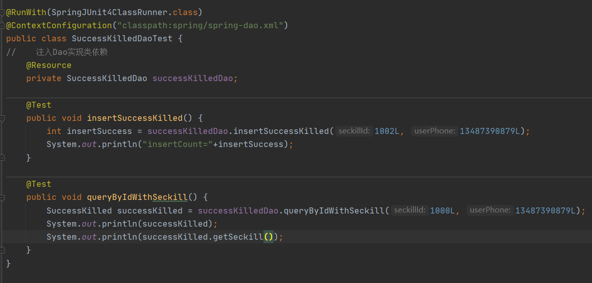

# 一个秒杀系统的简单实现

## 开发环境及技术栈

### 开发工具

IntelliJ2020.3

### 开发环境

JDK1.8 + Maven3.8.2 + MySQL8.0.25

### 技术栈

- 后端框架
  - Mybatis： Dao层的设计和开发，定义直接操作数据库的接口和方法，和Spring整合
  - Spring：Service层的设计和开发
  - SpringMVC：controller层的设计和开发

- Tomcat:web容器

- 前端：bootstrap、JavaScript、Jquery

- log4j: 日志框架

- MySQL:关系型数据库

- JUnit: 单元测试

## 步骤

### 需求分析

在正常的一个秒杀系统中，流程应该是

- 商家申请加入秒杀活动，添加和调整秒杀商品的相关信息以及秒杀开始和结束时间
- 平台审核商家的申请，并向商家发送申请成功或失败信息，如果失败商家可修改信息并再次提交
- 如果商家申请成功，用户可以访问秒杀商品列表并点击进入详情页，但是如果秒杀还未开始，用户只能看到倒计时和商品信息，而不能进行秒杀。
- 秒杀开始后，用户点击进行秒杀。系统减少用户商品的库存，并记录购买明细。如果用户退款，则又增加库存。

但是这个系统相对来说太大了，并且需要和其它模块共同开发。因此在这个项目中只实现秒杀的功能，

**具体的秒杀功能是指：**

- 若秒杀时间还未到或者当前时间超过秒杀结束时间，则向用户显示倒计时或秒杀结束。
- 当前时间在秒杀时间段内，向用户暴露秒杀接口。用户点击秒杀，系统执行。
  - 如果用户是第一次秒杀并且还有库存，则成功
  - 如果用户重复秒杀，向用户显示不可重复秒杀

### 创建项目及项目配置

#### 创建项目

1、使用Maven创建项目，因为我们是一个web项目，所以这里选maven自带的模型


2、填写groupId和ArtifactId

 

3、设置maven home 地址，如果之前没有再IDEA中配置好maven的地址需要重配一下。

 

4、补全相关的目录结构：File-Project structures-modules


#### 项目配置

1、首先webapp目录下的WEB-INF文件夹的web.xml文件中有默认的文件头。但是这个servlet版本过老，后续会出问题，所以需要更换它。


如何更换呢？

去到我们的tomcat\webapps\examples\WEB-INF目录下有一个默认的web.xml文件,里面有一个写好的默认文件头，将它复制到我们项目的web.xml配置文件中。


 

2、pom.xml配置

POM(Project Object Model,项目对象模型) 是Maven工程的基本单元，其中包含了项目的基本信息，用于描述项目如何构建，声明项目依赖。当执行项目时，Maven会在当前目录查找POM并读取，获取所需的配置信息。

默认生成的有

```xml
  <groupId>com.evelyn</groupId>
  <artifactId>mySeckill3</artifactId>
  <version>1.0-SNAPSHOT</version>
  <packaging>war</packaging>

  <name>mySeckill3 Maven Webapp</name>
  <!-- FIXME change it to the project's website -->
  <url>http://www.example.com</url>

  <properties>
    <project.build.sourceEncoding>UTF-8</project.build.sourceEncoding>
    <maven.compiler.source>1.7</maven.compiler.source>
    <maven.compiler.target>1.7</maven.compiler.target>
  </properties>
```

我们需要配置的有：

- 测试JUnit

```xml
<dependency>
  <groupId>junit</groupId>
  <artifactId>junit</artifactId>
  <version>4.12</version>
  <scope>test</scope>
</dependency>
```

- 日志log4j

```xml
<dependency>
      <groupId>org.slf4j</groupId>
      <artifactId>slf4j-api</artifactId>
      <version>1.7.32</version>
    </dependency>
```

```xml
<dependency>
      <groupId>log4j</groupId>
      <artifactId>log4j</artifactId>
      <version>1.2.12</version>
    </dependency>
```


- 数据库相关:mysql,druid连接池

```xml
<dependency>
      <groupId>mysql</groupId>
      <artifactId>mysql-connector-java</artifactId>
      <version>8.0.26</version>
      <scope>runtime</scope>
    </dependency>
    <dependency>
      <groupId>com.alibaba</groupId>
      <artifactId>druid</artifactId>
      <version>1.1.23</version>
    </dependency>
```


- mybatis相关

```xml
<dependency>
      <groupId>org.mybatis</groupId>
      <artifactId>mybatis</artifactId>
      <version>3.5.7</version>
</dependency>
<!--  mybatis自身实现的spring整合依赖  -->
<dependency>
      <groupId>org.mybatis</groupId>
      <artifactId>mybatis-spring</artifactId>
      <version>2.0.6</version>
 </dependency>
```


- servlet

```xml
<dependency>
  <groupId>taglibs</groupId>
  <artifactId>standard</artifactId>
  <version>1.1.2</version>
</dependency>
<dependency>
  <groupId>jstl</groupId>
  <artifactId>jstl</artifactId>
  <version>1.2</version>
</dependency>
<dependency>
  <groupId>com.fasterxml.jackson.core</groupId>
  <artifactId>jackson-databind</artifactId>
  <version>2.12.4</version>
</dependency>
<dependency>
  <groupId>javax.servlet</groupId>
  <artifactId>javax.servlet-api</artifactId>
  <version>3.1.0</version>
</dependency>
```

- spring核心、数据库、web、test

```xml
<!--    spring-->
<!--    spring核心-->
    <dependency>
      <groupId>org.springframework</groupId>
      <artifactId>spring-core</artifactId>
      <version>5.1.7.RELEASE</version>
    </dependency>
    <dependency>
      <groupId>org.springframework</groupId>
      <artifactId>spring-beans</artifactId>
      <version>5.1.7.RELEASE</version>
    </dependency>
    <dependency>
      <groupId>org.springframework</groupId>
      <artifactId>spring-context</artifactId>
      <version>5.1.7.RELEASE</version>
    </dependency>
<!--spring数据库-->
    <dependency>
      <groupId>org.springframework</groupId>
      <artifactId>spring-jdbc</artifactId>
      <version>5.1.7.RELEASE</version>
    </dependency>
    <dependency>
      <groupId>org.springframework</groupId>
      <artifactId>spring-tx</artifactId>
      <version>5.1.7.RELEASE</version>
    </dependency>
<!--spring web-->
    <dependency>
      <groupId>org.springframework</groupId>
      <artifactId>spring-web</artifactId>
      <version>5.1.7.RELEASE</version>
    </dependency>
    <dependency>
      <groupId>org.springframework</groupId>
      <artifactId>spring-webmvc</artifactId>
      <version>5.1.7.RELEASE</version>
    </dependency>
<!--spring-test-->
    <dependency>
      <groupId>org.springframework</groupId>
      <artifactId>spring-test</artifactId>
      <version>5.1.7.RELEASE</version>
    </dependency>
  </dependencies>
```

### Dao层设计和实现

*DAO* (DataAccessobjects 数据存取对象)是指位于业务逻辑和持久化数据之间实现对持久化数据的访问和操作。简单来说就是将对数据库的操作封装起来，对外提供相应的接口。提高耦合性。

所在在设计Dao层之前，我们要设计数据库。

#### 数据库设计

这里为了方便表示，我们只设计了两张表:sekill表和success_killed表分别存储秒杀商品的信息和用户秒杀成功的记录。


并且我们这里用用户的手机号来唯一表示一个用户，正常情况下应该设计一个用户表(包括用户账号和一些基本信息)和一个商品表(表示所有商品)，用用户账号来标识一个用户。后续会对这些方面进行扩充。


#### 实体类设计

实体类定义的就是我们操作数据库的表的实体。在java下创建包com.evelyn.pojo, 在pojo包下定义实体类，如seckill实体标识秒杀商品的相关信息。

  

另外，由于在秒杀成功记录里，我们的秒杀商品id也是其中一个字段，并且秒杀记录和商品id存在多对一的关系，所以我们在定义“秒杀成功记录”这个实体时，将商品记录也定义出来。

 

接下来就是在dao层定义操作数据库的接口并且基于Mybatis框架实现。

#### Dao层设计和开发

Seckill实体存储的时商品信息，包括Id,库存，秒杀时间段。因此对于这个实体，我们的操作应该包括: 根据Id查询商品，查询所有商品，减库存。另外，如果商品太多，我们不能一次性显示所有商品，因此还需要实现限制显示的商品数量或者<font color = 'red'>**分页（后面补充，基础版暂时不做）**</font>。

因此对应的接口设计为

 

对于SuccessKilled这个实体，我们需要的方法主要是记录(写入)成功购买信息以及根据商品Id和唯一指定用户的字段来查询记录。

 

这里我们可以看到有一个**@Param**注解，它的作用是用于传递参数。接下里讲到mybatisxml配置实现接口再来具体解释。

接下来通过mybatis的xml注解方式来实现接口。

首先需要配置mybatis

##### 配置mybatis

在src-main-resources目录下创建mybatis-config.xml进行配置(https://mybatis.org/mybatis-3/zh/index.html)，同时在resources目录下创建一个mapper来存我们对于Dao接口的实现。

先将标签约束加进去

```xml
<?xml version="1.0" encoding="UTF-8" ?>
<!DOCTYPE configuration
  PUBLIC "-//mybatis.org//DTD Config 3.0//EN"
  "http://mybatis.org/dtd/mybatis-3-config.dtd">
```

然后进行具体配置

```xml
<configuration>
<!--    配置全局属性-->
    <settings>
<!--        使用jdbc的getGeneratedKeys获取数据库自增主键值-->
        <setting name="useGeneratedKeys" value="true"/>
<!--        使用列别名替换列名，默认true-->
        <setting name="useColumnLabel" value="true"/>
<!--        开启驼峰命名转换:Table(create_time)->pojo(createTime)-->
        <setting name="mapUnderscoreToCamelCase" value="true"/>
        <setting name="logImpl" value="LOG4J"/>
    </settings>

</configuration>
```

##### 通过mybatis实现dao

在mapper目录下分别创建dao接口的xml配置文件

 

首先添加共同头部:注意这里的namespace不是共同的，需要指定到对应的Dao接口类

```xml
<?xml version="1.0" encoding="UTF-8" ?>
<!DOCTYPE mapper
        PUBLIC "-//mybatis.org//DTD Mapper 3.0//EN"
        "http://mybatis.org/dtd/mybatis-3-mapper.dtd">
<mapper namespace="com.evelyn.dao.SeckillDao">
</mapper>
```

然后在mapper标签内添加对应的接口实现: id指定对应的dao接口类的接口方法，resultType是返回类型，parameterType是参数类型。这里我们可以看到queryAll和reduceNumber接口都包含多个参数，那么这里就是为什么前面要使用@Param注解的原因了。**采用#{}的方式把@Param注解括号内的参数进行引用（括号内参数对应的是形参), xml映射的查询字段应该为@Param注解括号内的参数，这样当有多个参数的时候，形参才能匹配。**

```xml
<!--    目的：为Dao接口方法提供sql语句配置-->
    <select id="queryById" resultType="Seckill" parameterType="long">
        select seckill_id,name,number,start_time,end_time,create_time
        from myseckill.seckill
        where seckill_id = #{seckillId};
    </select>

    <select id="queryAll" resultType="Seckill">
        select *
        from myseckill.seckill
        order by create_time desc
        limit #{offset},#{limit};
    </select>
    <update id="reduceNumber">
        update myseckill.seckill
        set number=number-1
        where seckill_id=#{seckillId}
        and start_time <![CDATA[<=]]> #{killTime}
        and end_time <![CDATA[>=]]> #{killTime}
        and number <![CDATA[>]]> 0;
    </update>
```

对于SuccessKilled实现类，也是这样

```xml
 <insert id="insertSuccessKilled">
# 主键冲突会报错，这里用ignore忽略报错而是直接返回
        insert ignore into myseckill.success_killed(seckill_id,user_phone,state)
        values (#{seckillId},#{userPhone},0);
    </insert>

<!--    根据商品id查询successKilled并携带秒杀产品对象实体-->
    <select id="queryByIdWithSeckill" resultType="SuccessKilled">
# 如何告诉Mybatis把结果映射到SuccessKilled同时映射seckill属性
        select sk.seckill_id, sk.user_phone, sk.state, sk.create_time,
               sc.seckill_id "secKill.seckill_id",
               sc.name "secKill.name",
               sc.number "secKill.number",
               sc.start_time "secKill.start_time",
               sc.end_time "secKill.end_time",
               sc.create_time "secKill.create_time"
        from myseckill.success_killed sk inner join
            myseckill.seckill sc on sk.seckill_id=sc.seckill_id
        where sk.seckill_id=#{seckillId} and sk.user_phone=#{userPhone};
    </select>
```

##### mybatis整合Spring

从mybatis执行流程中可以看出来，mybatis框架要创建dao代理对象，第一件事情就是要加载主配置文件，构建SqlSessionFactory对象，只有有了SqlSessionFactory对象，mybatis才能做后续的操作，所以spring整合mybatis的原理要做的事情就是让Spring帮助我们去创建mybatis的SqlSessionFactory对象，Spring要想去创建SqlSessionFactory,那么在Spring中就必须去加载mybatis的配置信息，

###### 具体操作

首先在resources目录下创建一个spring文件夹，存放我们所有的spring配置文件。

然后在其下创建spring-dao.xml:就是dao相关的配置

我们去官网找到spring对应版本的官方文档，这里用的5.1.7

https://docs.spring.io/spring-framework/docs/

点击最后一个spring-framework-ref..


找到core相关的container overview

 

往下滑可以看到它的配置

将头部复制过去，报错，另外这张图还少了一个</beans>结束标签


解决方法

统一资源标识符没有注册，解决方法就是将这个标识符手动添加到IDEA中，首先复制报红色的那串代码（只要红色的部分），然后把报错的url加进去。

- file --> settings- -> languages & frameworks -->Schemas and DTDs

 

注意添加其它的时候要同步添加这些

 

然后我们在resources目录下创建jdbc.properties文件配置数据库

```properties
druid.driver=com.mysql.cj.jdbc.Driver
druid.url=jdbc:mysql://localhost:3306/myseckill?zeroDateTimeBehavior=convertToNull&useUnicode=true&characterEncoding=UTF-8&useJDBCCompliantTimezoneShift=true&useLegacyDatetimeCode=false&serverTimezone=UTC
druid.username=root
druid.password=whwqwy0418
druid.initialSize=10
druid.minIdle=6
druid.maxActive=50
druid.maxWait=60000
druid.timeBetweenEvictionRunsMillis=60000
druid.minEvictableIdleTimeMillis=300000
druid.validationQuery=SELECT 'x'
druid.testWhileIdle=true
druid.testOnBorrow=false
druid.testOnReturn=false
druid.poolPreparedStatements=false
druid.maxPoolPreparedStatementPerConnectionSize=20
druid.filters=wall,stat
```

resources目录下创建spring文件，在里面写spring-dao.xml，实现整合。主要需要配置的有

- 数据库相关参数：指定数据库配置文件的路径
- 数据库连接池：这里使用阿里巴巴的**druid连接池**
- 配置SqlSessionFactory对象(比较重要)

<bean id="sqlSessionFactory" class="org.mybatis.spring.SqlSessionFactoryBean">
<!--        注入数据库连接池-->
        <property name="dataSource" ref="dataSource" />
<!--        配置Mybatis全局配置文件:mybatis-config.xml-->
        <property name="configLocation" value="classpath:mybatis-config.xml" />
<!--   扫描pojo包，使用别名 com.evelyn.pojo.Seckill-Seckill-->
        <property name="typeAliasesPackage" value="com.evelyn.pojo" />
<!--        扫描sql配置文件：mapper需要的xml文件-->
        <property name="mapperLocations" value="classpath:mapper/*.xml" />
    </bean>

- 配置接口扫描包，动态实现Dao接口，注入到spring容器中

<!--    4:配置扫描Dao接口包，动态实现Dao接口，注入到spring容器中-->
    <bean class="org.mybatis.spring.mapper.MapperScannerConfigurer">
<!--        注入sqlSessionFactory:后处理，要用的时候才去找-->
        <property name="sqlSessionFactoryBeanName" value="sqlSessionFactory" />
        <!--给出需要扫描Dao接口包-->
        <property name="basePackage" value="com.evelyn.dao"/>
    </bean>

```xml
<!--配置整合mybatis过程
        1.配置数据库相关参数-->
    <context:property-placeholder location="classpath:jdbc.properties"/>

    <!--2.数据库连接池-->
    <bean id="dataSource" class="com.alibaba.druid.pool.DruidDataSource" init-method="init" destroy-method="close">
        <!--  配置连接池属性 -->
        <property name="driverClassName" value="${druid.driver}"/>
        <property name="url" value="${druid.url}"/>
        <property name="username" value="${druid.username}"/>
        <property name="password" value="${druid.password}"/>
        <!-- 初始化连接数量 -->
        <property name="initialSize" value="${druid.initialSize}" />
        <!-- 最小空闲连接数 -->
        <property name="minIdle" value="${druid.minIdle}" />
        <!-- 最大并发连接数 -->
        <property name="maxActive" value="${druid.maxActive}" />
        <!-- 配置获取连接等待超时的时间 -->
        <property name="maxWait" value="${druid.maxWait}" />

        <!-- 配置间隔多久才进行一次检测，检测需要关闭的空闲连接，单位是毫秒 -->
        <property name="timeBetweenEvictionRunsMillis" value="${druid.timeBetweenEvictionRunsMillis}" />

        <!-- 配置一个连接在池中最小生存的时间，单位是毫秒 -->
        <property name="minEvictableIdleTimeMillis" value="${druid.minEvictableIdleTimeMillis}" />
        <property name="validationQuery" value="${druid.validationQuery}" />
        <property name="testWhileIdle" value="${druid.testWhileIdle}" />
        <property name="testOnBorrow" value="${druid.testOnBorrow}" />
        <property name="testOnReturn" value="${druid.testOnReturn}" />

        <!-- 打开PSCache，并且指定每个连接上PSCache的大小 如果用Oracle，则把poolPreparedStatements配置为true，mysql可以配置为false。 -->
        <property name="poolPreparedStatements" value="${druid.poolPreparedStatements}" />
        <property name="maxPoolPreparedStatementPerConnectionSize"
                  value="${druid.maxPoolPreparedStatementPerConnectionSize}" />

        <!-- 配置监控统计拦截的filters -->
        <property name="filters" value="${druid.filters}" />
    </bean>

<!--    3 最重要的：配置SqlSessionFactory对象-->
    <bean id="sqlSessionFactory" class="org.mybatis.spring.SqlSessionFactoryBean">
<!--        注入数据库连接池-->
        <property name="dataSource" ref="dataSource" />
<!--        配置Mybatis全局配置文件:mybatis-config.xml-->
        <property name="configLocation" value="classpath:mybatis-config.xml" />
<!--   扫描pojo包，使用别名 com.evelyn.pojo.Seckill-Seckill-->
        <property name="typeAliasesPackage" value="com.evelyn.pojo" />
<!--        扫描sql配置文件：mapper需要的xml文件-->
        <property name="mapperLocations" value="classpath:mapper/*.xml" />
    </bean>

<!--    4:配置扫描Dao接口包，动态实现Dao接口，注入到spring容器中-->
    <bean class="org.mybatis.spring.mapper.MapperScannerConfigurer">
<!--        注入sqlSessionFactory:后处理，要用的时候才去找-->
        <property name="sqlSessionFactoryBeanName" value="sqlSessionFactory" />
        <!--给出需要扫描Dao接口包-->
        <property name="basePackage" value="com.evelyn.dao"/>
    </bean>
```

好了！大功告成，接下来就是测试，我们在完成每一个接口或者每一层，都需要及时进行单元测试。这里有很简单的自动生成测试类(模型)的方法。

#### 测试

测试每一个dao的方法是否通过

快捷键，将鼠标放在Dao类上，然后点Moreactions

 

点createTest

 

选junit4, 勾选三个方法，会自动在test目录下的对应包创建test

 


 

然后编写具体的测试方法

 

 

至此，dao层的开发结束。

上面是最终代码。其实测试的时候还报了很多错误。然后根据错误进行了修改。

##### 报错分析

我们在看报错的时候，要从下网上看，找到**caused by**

> Caused by: org.apache.ibatis.builder.BuilderException**: The setting userColumnLabel is not known.  Make sure you spelled it correctly (case sensitive).** 
> 	at org.apache.ibatis.builder.xml.XMLConfigBuilder.settingsAsProperties(XMLConfigBuilder.java:135)
> 	at org.apache.ibatis.builder.xml.XMLConfigBuilder.parseConfiguration(XMLConfigBuilder.java:107)

意思是mybatis-config里面的userColumnLablel无法解析，可能是写错了,果然应该是useColumnLabel

修改之后运行

> **Caused by: org.apache.ibatis.builder.BuilderException: The setting mapUnderscoreCameCase is not known.**  Make sure you spelled it correctly (case sensitive).
> 	at org.apache.ibatis.builder.xml.XMLConfigBuilder.settingsAsProperties(XMLConfigBuilder.java:135)
> 	at org.apache.ibatis.builder.xml.XMLConfigBuilder.parseConfiguration(XMLConfigBuilder.java:107)
> 	... 44 more

还是属性写错了，修改成mapUnderscoreToCamelCase

> Caused by: **org.apache.ibatis.builder.BuilderException: Mapper's namespace cannot be empty**
> 	at org.apache.ibatis.builder.xml.XMLMapperBuilder.configurationElement(XMLMapperBuilder.java:113)
> 	... 44 more

mapper的命名空间为空，就是没指明命名空间，去mapper目录下的那两个xml配置文件看看，发现果然没写

 

 

数据库连接池问题

> Caused by: **com.mchange.v2.resourcepool.TimeoutException: A client timed out while waiting to acquire a resource from** com.mchange.v2.resourcepool.BasicResourcePool@7a9c84a5 -- timeout at awaitAvailable()
> 	at com.mchange.v2.resourcepool.BasicResourcePool.awaitAvailable(BasicResourcePool.java:1317)
> 	at com.mchange.v2.resourcepool.BasicResourcePool.prelimCheckoutResource(BasicResourcePool.java:557)
> 	at com.mchange.v2.resourcepool.BasicResourcePool.checkoutResource(BasicResourcePool.java:477)
> 	at com.mchange.v2.c3p0.impl.C3P0PooledConnectionPool.checkoutPooledConnection(C3P0PooledConnectionPool.java:525)
> 	... 59 more

最开始用的c3p0，但是一直不行，最后换成了druid

但是druid又出错了

> Caused by: **java.sql.SQLException: Access denied for user 'root'@'localhost' (using password: YES)**
> 	at com.mysql.cj.jdbc.exceptions.SQLError.createSQLException(SQLError.java:129)
> 	at com.mysql.cj.jdbc.exceptions.SQLExceptionsMapping.translateException(SQLExceptionsMapping.java:122)
> 	at com.mysql.cj.jdbc.ConnectionImpl.createNewIO(ConnectionImpl.java:828)
> 	at com.mysql.cj.jdbc.ConnectionImpl.<init>(ConnectionImpl.java:448)
> 	at com.mysql.cj.jdbc.ConnectionImpl.getInstance(ConnectionImpl.java:241)
> 	at com.mysql.cj.jdbc.NonRegisteringDriver.connect(NonRegisteringDriver.java:198)
> 	at com.alibaba.druid.filter.FilterChainImpl.connection_connect(FilterChainImpl.java:156)
> 	at com.alibaba.druid.filter.stat.StatFilter.connection_connect(StatFilter.java:218)
> 	at com.alibaba.druid.filter.FilterChainImpl.connection_connect(FilterChainImpl.java:150)
> 	at com.alibaba.druid.filter.FilterAdapter.connection_connect(FilterAdapter.java:787)
> 	at com.alibaba.druid.filter.FilterChainImpl.connection_connect(FilterChainImpl.java:150)
> 	at com.alibaba.druid.pool.DruidAbstractDataSource.createPhysicalConnection(DruidAbstractDataSource.java:1646)
> 	at com.alibaba.druid.pool.DruidAbstractDataSource.createPhysicalConnection(DruidAbstractDataSource.java:1710)
> 	at com.alibaba.druid.pool.DruidDataSource.init(DruidDataSource.java:912)
> 	at sun.reflect.NativeMethodAccessorImpl.invoke0(Native Method)
> 	at sun.reflect.NativeMethodAccessorImpl.invoke(NativeMethodAccessorImpl.java:62)
> 	at sun.reflect.DelegatingMethodAccessorImpl.invoke(DelegatingMethodAccessorImpl.java:43)
> 	at java.lang.reflect.Method.invoke(Method.java:498)
> 	at org.springframework.beans.factory.support.AbstractAutowireCapableBeanFactory.invokeCustomInitMethod(AbstractAutowireCapableBeanFactory.java:1903)
> 	at org.springframework.beans.factory.support.AbstractAutowireCapableBeanFactory.invokeInitMethods(AbstractAutowireCapableBeanFactory.java:1846)
> 	at org.springframework.beans.factory.support.AbstractAutowireCapableBeanFactory.initializeBean(AbstractAutowireCapableBeanFactory.java:1774)
> 	... 39 more

太奇怪了，重新写一遍密码就对了，我也是醉了。。。


终于！！！！


至此，真正完成Dao层设计和开发，接下来是Service层的设计和开发


### Service层

Dao层完成的是接口设计+SQL编写，如何对数据库进行操作，将代码和SQL分离，方便检查和维护。

而Service层的目标是将这些分离的数据库操作根据用户的执行逻辑去连接起来，形成一个个的业务。

#### 设计接口

在设计业务接口的时候，我们要站在使用者的角度去设计。

使用者会用到哪些业务呢？

第一个： 查询所有秒杀商品的列表，用户进入的时候就需要看到当前的所有秒杀商品的明细。

第二个：对于某个商品，跳转到商品对应的详情页

第三个：秒杀接口暴露。秒杀开启时输出秒杀接口地址，否则输出系统时间和秒杀时间

第四个：执行秒杀操作，用户点击秒杀，进行一些秒杀确认操作

```xml
/**
 * 业务接口：站在"使用者"角度设计接口
 * 三个方面：
 *  方法定义粒度：比如使用者只秒杀，而不需要关注库存减少审美点
 *  参数：越简单越明确越好
 *  返回：类型，异常
 */
public interface SeckillService {
    /**
     * 查询秒杀商品列表
     * @return
     */
    List<Seckill> getSeckillList();

    /**
     * 查询单个秒杀商品
     * @param seckillId
     * @return
     */
    Seckill getById(long seckillId);

    /**
     * 秒杀开启时输出秒杀接口地址，否则输出系统时间和秒杀时间
     * 意思就是秒杀还没开始的时候是没有地址的
     * @param seckillId
     */
    Exposer exportSeckillUrl(long seckillId);

    /**
     * 执行秒杀操作
     * @param seckillId 秒杀商品id
     * @param userPhone 用户手机号，这里是作为用户id的作用
     * @param md5 加密后的秒杀商品id,用于生成链接。
     */
    SeckillExecution excuteSeckill(long seckillId, long userPhone, String md5)
            throws SeckillException, RepeatKillException, SeckillCloseException;
}
```

在这里，我们需要向用户输出新的不属于数据库内容的实体，因此，新建一个dto包，包下存放这些实体的声明，将他们封装好。实现service和controller的数据传递。这里要思考一下要对用户显示什么。

- 要向用户暴露的秒杀地址。当秒杀还未开始时，不能向用户展示秒杀接口，只有当秒杀开始的时候才能暴露。而这个接口必须要是单向的，就是说只能通过某种方法生成它，而不能让用户解析它。所以需要加密。(见dto.Exposer)
- 然后是秒杀执行后的状态。成功or失败？秒杀的记录是？(见dto.SeckillExecution)

#### 接口实现

我们在实现类中需要使用注解，因此要先进行配置，spring目录下新建spring-service.xml

```xml
<?xml version="1.0" encoding="UTF-8"?>
<beans xmlns="http://www.springframework.org/schema/beans"
       xmlns:xsi="http://www.w3.org/2001/XMLSchema-instance"
       xmlns:context="http://www.springframework.org/schema/context"
       xsi:schemaLocation="http://www.springframework.org/schema/beans
        https://www.springframework.org/schema/beans/spring-beans.xsd
        http://www.springframework.org/schema/context
        https://www.springframework.org/schema/context/spring-context.xsd">
</beans>
```

在service包下建一个serviceImpl包，里面存放每个service接口的实现类。

首先，使用@Service注解标明该类是一个服务。并将相关的dao对象注入到service中(使用@Autowired注解)

```java
@Service
public class SeckillServiceImpl implements SeckillService {
    //日志
    private Logger logger = Logger.getLogger(SeckillServiceImpl.class);
    //对象
//    注入Service依赖 @Service,@Resource等
    @Autowired
    private SeckillDao seckillDao;
    @Autowired
    private SuccessKilledDao successKilledDao;
```

前两个方法直接调用dao对象的方法即可

```java
@Override
public List<Seckill> getSeckillList() {
    return seckillDao.queryAll(0, 100);
}

/**
 * 查询单个商品
 *
 * @param seckillId
 * @return
 */
@Override
public Seckill getById(long seckillId) {
    return seckillDao.queryById(seckillId);
}
```

对于秒杀接口暴露的这个方法,具体的流程是：

- 先查找是否存在这个商品，如果没有这个商品，就没有暴露接口
- 如果有，获取其起始时间和系统当前时间
  - 如果系统当前时间不在秒杀时间范围内，生成一个接口
  - 如果在范围内，获取加密的id，生成接口

```java
/**
     * 秒杀开启时输出秒杀接口地址，否则输出系统时间和秒杀时间
     * 意思就是秒杀还没开始的时候是没有地址的
     *
     * @param seckillId
     */
    @Override
    public Exposer exportSeckillUrl(long seckillId) {
        Seckill seckill = seckillDao.queryById(seckillId);
        // 调用不同的构造方法，只有在时间范围内才生成md5，在执行秒杀的业务中，如果md5为空则是不能正确执行秒杀的
        if(seckill==null){
            return new Exposer(false,seckillId);
        }
        Date startTime = seckill.getStartTime();
        Date endTime = seckill.getEndTime();
//        系统时间
        Date nowTime = new Date();
        if(startTime.getTime()>nowTime.getTime()||endTime.getTime()<nowTime.getTime()){
            return new Exposer(false,seckillId,nowTime.getTime(),startTime.getTime(),endTime.getTime());
        }
        //转化特定字符串的过程，不可逆，就算把这个转化后的结果显示给用户，用户也猜不出来到底是啥
        String md5=getMD5(seckillId);
        return new Exposer(true,md5,seckillId);
    }
```

```java
//加盐，为了加密，混淆md5,随便写
    private final String salt="addjidjigjeijgeoejei8eur8u8&#$$(@)";
    //对象
//    注入Service依赖 @Service,@Resource等

    private String getMD5(long seckillId){
        String base = seckillId+"/"+salt;
        String md5 = DigestUtils.md5DigestAsHex(base.getBytes());
        return md5;
    }
```


然后是秒杀地址已经暴露，执行秒杀业务。

```java
@Transactional
    /**
     * 使用注解控制事务方法的优点：
     * 1、开发团队达成一致约定，明确标注事务方法的编程风格
     * 2、保证事务方法的执行时间尽可能短，不要穿插其它网络操作，RFC/HTTP请求剥离到事务方法外部
     * 3、不是所有方法都需要事务，如只有一条修改操作，只读操作不需要事务控制
     */
    @Override
    public SeckillExecution excuteSeckill(long seckillId, long userPhone, String md5) throws SeckillException, RepeatKillException, SeckillException {
        //如果md5为空
        if(md5==null){
            throw new SeckillCloseException("没有拿到md5");
        }
        //比较传入的md5是否等于通过方法生成的md5，如果不等就报错。这里md5起始还可以根据用户id和商品id来共同生成
        if(!md5.equalsIgnoreCase(getMD5(seckillId))){
            throw new SeckillCloseException("seckill data rewrite");
        }
        //执行秒杀逻辑：减库存+记录购买行为
        Date nowTime = new Date();
        try {

            //更新库存，秒杀成功,增加明细
            int insertCount = successKilledDao.insertSuccessKilled(seckillId, userPhone);
            //看是否该明细被重复插入，即用户是否重复秒杀
            if (insertCount <= 0) {
                throw new RepeatKillException("seckill repeated");
            } else {//如果明细被正确加入
                //减库存,热点商品竞争
                int updateCount = seckillDao.reduceNumber(seckillId, nowTime);
                if (updateCount <= 0) {
                    //没有更新库存记录，说明秒杀结束 rollback
                    throw new SeckillCloseException("seckill is closed");
                } else {
                    //秒杀成功,得到成功插入的明细记录,并返回成功秒杀的信息 commit
                    SuccessKilled successKilled = successKilledDao.queryByIdWithSeckill(seckillId, userPhone);
                    return new SeckillExecution(seckillId, SeckillStateEnum.SUCCESS, successKilled);
                }

            }
        }catch (SeckillCloseException e1){
            throw e1;
        }catch (RepeatKillException e2){
            throw e2;
        } catch (Exception e){
            //所有编译期异常转化为运行期异常
            throw new SeckillException("seckill inner error"+e.getMessage());
        }
    }
```


我们在实际项目中要根据我们的程序自定义一些运行期异常，并进行处理。新建exception包，自定义一些异常。如

 

另外对于一些状态信息，定义枚举类来实现，enums包

```java
/**
 * 使用枚举标识我们的常量数据字段，封装state和stateInfo
 */
public enum SeckillStateEnum {
    SUCCESS(1,"秒杀成功"),
    END(0,"秒杀结束"),
    REPEAT_KILL(-1,"重复秒杀"),
    INNER_ERROR(-2,"系统异常"),
    DATA_REWRITE(-3,"数据篡改");

    private int state;
    private String stateInfo;

    SeckillStateEnum(int state, String stateInfo) {
        this.state = state;
        this.stateInfo = stateInfo;
    }

    public int getState() {
        return state;
    }

    public void setState(int state) {
        this.state = state;
    }

    public String getStateInfo() {
        return stateInfo;
    }

    public void setStateInfo(String stateInfo) {
        this.stateInfo = stateInfo;
    }

    public static SeckillStateEnum stateOf(int index){
        for(SeckillStateEnum state:values()){
            if(state.getState()==index){
                return state;
            }
        }
        return null;
    }
}
```

#### 测试

由于对于数据库的更新操作需要用到事务，所以我们要配置，然后使用对需要使用事务的方法使用@Transactional注解

```xml
<!--    扫描service包下所有使用注解的类型-->
    <context:component-scan base-package="com.evelyn.service"/>
    <!--    配置事务管理器-->
    <bean id="transactionManager" class="org.springframework.jdbc.datasource.DataSourceTransactionManager">
<!--        注入数据库连接池-->
        <property name="dataSource" ref="dataSource"/>
    </bean>

<!--    配置基于注解的声明式事务:默认使用注解来管理事务行为-->
    <tx:annotation-driven transaction-manager="transactionManager"/>
```

 


生成测试类，写测试方法.

和之前一样，到Service接口里面自动生成测试类，添加注解

 为什么要加两个classpath，因为我们测试service依赖于dao的配置

```java
@RunWith(SpringJUnit4ClassRunner.class)

@ContextConfiguration({
        "classpath:spring/spring-service.xml",
        "classpath:spring/spring-dao.xml"})
public class SeckillServiceTest {
    private Logger logger = Logger.getLogger(SeckillServiceTest.class);
    @Autowired
    private SeckillService seckillService;

    @Test
    public void getSeckillList() {
        List<Seckill> seckillList = seckillService.getSeckillList();
//        for(Seckill seckill:seckillList){
//            System.out.println(seckillList);
//        }
        /**
         * [Seckill
         * {seckillId=1000,name='1000元秒杀iphone6',number=89,startTime=Thu Sep 16 08:00:00 CST 2021,
         * endTime=Fri Sep 24 08:00:00 CST 2021,createTime=Mon Sep 13 05:58:58 CST 2021},
         * Seckill{seckillId=1001,name='500元秒杀iPad2',number=198, startTime=Wed Sep 08 08:00:00 CST 2021,
         * endTime=Thu Sep 23 08:00:00 CST 2021, createTime=Mon Sep 13 05:58:58 CST 2021},
         * Seckill{seckillId=1002, name='300元秒杀小米4', number=300, startTime=Sun May 22 08:00:00 CST 2016,
         * endTime=Thu May 23 08:00:00 CST 2019, createTime=Mon Sep 13 05:58:58 CST 2021},
         * Seckill{seckillId=1003, name='200元秒杀红米note', number=400, startTime=Sun May 22 08:00:00 CST 2016,
         * endTime=Mon May 23 08:00:00 CST 2016, createTime=Mon Sep 13 05:58:58 CST 2021}]
         */

        logger.info("seckillList ");
        System.out.println(seckillList);
    }

    @Test
    public void getById() {
        Seckill seckill = seckillService.getById(1000L);
        /**
         * seckill Seckill{seckillId=1000, name='1000元秒杀iphone6', number=89, startTime=Thu Sep 16 08:00:00 CST 2021,
         * endTime=Fri Sep 24 08:00:00 CST 2021, createTime=Mon Sep 13 05:58:58 CST 2021}
         */
        logger.info("seckill "+seckill);
    }

    //测试代码完整逻辑，注意重复秒杀可能的问题
    @Test
    public void testSeckillLogic() throws Exception{
        long id = 1001;
        Exposer exposer = seckillService.exportSeckillUrl(id);
        if(exposer.isExposed()){
            logger.info("exposer: "+exposer);
            long phone = 13458938588L;
            String md5 = exposer.getMd5();
            try {
                SeckillExecution seckillExecution = seckillService.excuteSeckill(id, phone, md5);
                System.out.println("输出输出");
                System.out.println(seckillExecution);
            }catch (RepeatKillException e1){
                logger.error(e1.getMessage());
                System.out.println("重复了吗");
            }catch (SeckillCloseException e2){
                logger.error(e2.getMessage());
                System.out.println("关闭");
            }catch (Exception e){
                logger.error(e.getMessage());
            }
        }else{
            //秒杀未开启
            logger.warn("exposer:"+exposer);
        }
    }
}
```

### Controller层的设计和开发

这一层主要是为了实现前端的交互。就是我们如何把前端的这些按钮和service层的这些业务联系起来呢？

这里使用了：

Restful: url的设计规范

springmvc:配置和应用，设计和实现

bootstrap:页面布局,样式控制

jquery:交互实现+插件

这个项目的前端页面流程就是：

打开进入列表页->选择某个商品点击进入详情->用户是否登录？->如果登陆了就直接显示秒杀按钮或者显示倒计时->没有登录就要先登录，写入cookie再显示秒杀按钮或者显示倒计时

详情页具体逻辑为：

 

#### Restful

Restful是一种URL设计理念，根据这个理念设计出来的url

 

#### springMVC

围绕Handleer开发，分为Model+View,model可理解为一个map, View页面样式。

流程为：

 

第一步：用户发送请求，所有的请求都会映射到DispatherServlet，中央控制器Servlet，会拦截所有请求。

第二步：默认会用到DefaultAnnotationHandlerMapping, 作用是用来映射url,哪个Url对应到哪个具体的Handler

第三步：使用默认的DefaultAnnotatinHandlerAdapter, 用来做Handler适配，最终衔接到我们自己开发的SeckillController(第四步)

第五步：返回ModelAndView,交付给DispatchServlet

第六步：InternalResourceViewResolver将Model和list.jsp结合，返回给用户

开发的时候只需要开发SeckillController,然后使用注解映射即可。

#### 配置

web.xml配置DispatcherServlet和SpringMVC需要加载的配置文件

```xml
<!--  用maven创建的webapp配置文件要修改版本-->
<!--    配置DispatcherServlet-->
    <servlet>
        <servlet-name>seckill-dispatcher</servlet-name>
        <servlet-class>org.springframework.web.servlet.DispatcherServlet</servlet-class>
<!--        配置SpringMVC需要加载的配置文件
            spring-dao.xml,spring-service.xml,spring-web.xml
            mybatis->spring->springmvc
-->
        <init-param>
            <param-name>contextConfigLocation</param-name>
            <param-value>classpath:spring/spring-*.xml</param-value>
        </init-param>
    </servlet>
    <servlet-mapping>
        <servlet-name>seckill-dispatcher</servlet-name>
<!--        默认匹配所有的请求-->
        <url-pattern>/</url-pattern>
    </servlet-mapping>
```


然后配置spring-controller.xml

```xml
<!--    配置springmvc-->
    <!--    1:开启springMVC注解模式
                -自动注册DefaultAnnotationHandlerMapping,AnnotationMethodHandlerAdapter
                -提供一系列数据绑定、数字和时间format @NumberFormat,@DateTimeFormat;xml,json默认读写支持
    -->
    <mvc:annotation-driven/>

    <!--    2:servlet-mapping 映射路径:"/" 需要静态资源配置
            静态资源默认servlet配置
                -加入对静态资源的处理:js,gif,png
                -允许使用"/"作整体映射
    -->
    <mvc:default-servlet-handler/>

    <!--    3: 配置jsp显示ViewResolver-->
    <bean class="org.springframework.web.servlet.view.InternalResourceViewResolver">
        <property name="viewClass" value="org.springframework.web.servlet.view.JstlView"/>
        <property name="prefix" value="/WEB-INF/jsp"/>
        <property name="suffix" value=".jsp"/>
    </bean>

    <!--    4: 扫描web相关的bea-->
    <context:component-scan base-package="com.evelyn.controller"/>
```


#### 开发

  


 


蓝色部分：占位符匹配，<font color = 'blue'>@PathVariable("seckillId")</font> 绑定方法参数seckillId，对应到URL的<font color = 'blue'>{seckillId}</font>。当用户传递对应的URL时，把对应的URL中的{seckillId}部分获取到，然后传入detail方法中

粉色部分：只允许Get方法访问，post方法方位则不会映射

绿色部分：承载最后返回给用户的数据，页面中通过""里的值拿到对应的数据

红色部分：请求重定向or转发

>  @RequestMapping(value = "/<font color = 'blue'>{seckillId}</font>/detail",<font color = 'pink'>method = RequestMethod.GET</font>)
>     public String detail(<font color = 'blue'>@PathVariable("seckillId")</font> Long seckillId,<font color = 'green'>Model model</font>){
>         if(seckillId == null){
>             return "<font color = 'red'>redirect</font>:/seckill/list";
>         }
>         Seckill seckill = seckillService.getById(seckillId);
>         if(seckill == null){
>             return "<font color = 'red'>forward</font>:/seckill/list";
>         }
>         <font color = 'green'>model.addAttribute("seckill",seckill);</font>
>         return "detail";//返回这个键， 返回对应的jsp, 将model结果传递给jsp，作相应的替换
>     }


如何返回json数据

> @RequestMapping(value = "/{seckillId}/{md5}/execution",
>                         method = RequestMethod.POST,
>                         <font color = 'red'>produces = {"application/json;charset=UTF-8"}</font>)//返回header，告诉浏览器返回的是Json
>
> ​    @ResponseBody //返回json的内容
> ​    public SeckillResult<SeckillExecution> execute(@PathVariable("seckillId") Long seckillId,
> ​                                                   @PathVariable("md5") String md5,
> ​                                                   @CookieValue(value = "killPhone",required = false) Long phone){
> ​        SeckillResult<SeckillExecution> result;  **//把数据封装成json**
> //        springmvc valid方式可以去了解一下
> ​        if(phone==null){
> ​            return new SeckillResult<>(false,"未注册");
> ​        }
> ​        try {
> ​            //执行秒杀，返回结果
> ​            SeckillExecution seckillExecution = seckillService.excuteSeckill(seckillId, phone, md5);
> ​           
> ​        }catch (RepeatKillException e1){
> ​           
> ​        }catch (SeckillCloseException e2){
> ​            
> ​        } catch (Exception e){
> ​            
> ​        }
>
> return result;
>
> ​    }

Cookie访问

> @RequestMapping(value = "/{seckillId}/{md5}/execution",
>                         method = RequestMethod.POST,
>                         produces = {"application/json;charset=UTF-8"})
>     @ResponseBody
>     public SeckillResult<SeckillExecution> execute(@PathVariable("seckillId") Long seckillId,
>                                                    @PathVariable("md5") String md5,
>                                                    **@CookieValue(value = "killPhone",required = false) Long phone**){


```java
package com.evelyn.controller;


import com.evelyn.dto.Exposer;
import com.evelyn.dto.SeckillExecution;
import com.evelyn.dto.SeckillResult;
import com.evelyn.enums.SeckillStateEnum;
import com.evelyn.exception.RepeatKillException;
import com.evelyn.exception.SeckillCloseException;
import com.evelyn.exception.SeckillException;
import com.evelyn.pojo.Seckill;
import com.evelyn.service.SeckillService;
import com.sun.org.apache.bcel.internal.generic.RETURN;
import org.apache.log4j.Logger;
import org.springframework.beans.factory.annotation.Autowired;
import org.springframework.stereotype.Controller;
import org.springframework.ui.Model;
import org.springframework.web.bind.annotation.*;

import java.util.Date;
import java.util.List;

@Controller //@Service @Component
@RequestMapping("/seckill")  //注解映射地址url:/模块/资源/{id}/细分/seckill/list
public class SeckillController {
    //日志
    private final Logger logger = Logger.getLogger(SeckillController.class);

    //注入service对象
    @Autowired
    private SeckillService seckillService;

//    指定二级url,以及请求模式
    @RequestMapping(value = "/list",method = RequestMethod.GET)
    public String list(Model model){
//        获取列表页
        //list.jsp+model=ModelAndView
        List<Seckill> seckillList = seckillService.getSeckillList();
        model.addAttribute("list",seckillList);

        return "list";// 返回键，/WEB-INF/jsp/"list".jsp
    }

    
    @RequestMapping(value = "/{seckillId}/detail",method = RequestMethod.GET)
    public String detail(@PathVariable("seckillId") Long seckillId,Model model){
        if(seckillId==null){
            return "redirect:/seckill/list";
        }
        Seckill seckill = seckillService.getById(seckillId);
        if(seckill==null){
            return "forward:/seckill/list";
        }
        model.addAttribute("seckill",seckill);
        return "detail";
    }

//    ajax jason输出秒杀地址
    //POST的意思是你直接在浏览器敲入这个地址是无效的
    //produce乱码问题解决
    @RequestMapping(value = "/{seckillId}/exposer",
            method = RequestMethod.POST,
            produces = {"application/json;charset=UTF-8"})
    @ResponseBody //封装成json
    public SeckillResult exposer(@PathVariable Long seckillId){
        SeckillResult<Exposer> result;
        try {
            Exposer exposer = seckillService.exportSeckillUrl(seckillId);
            result = new SeckillResult<Exposer>(true, exposer);
        }catch (Exception e){
            logger.error(e.getMessage(),e);
            result = new SeckillResult<>(false,e.getMessage());
        }
        return  result;
    }

//    执行秒杀
    //这里phone是因为我们没做登录模块，后面可以把登录模块加上,然后是从cookie获取的
    //@CookieValue(value = "killPhone",required = false) 这里的false指的是如果没有该字段，不会报错，而是在程序中再处理

    @RequestMapping(value = "/{seckillId}/{md5}/execution",
                        method = RequestMethod.POST,
                        produces = {"application/json;charset=UTF-8"})
    @ResponseBody
    public SeckillResult<SeckillExecution> execute(@PathVariable("seckillId") Long seckillId,
                                                   @PathVariable("md5") String md5,
                                                   @CookieValue(value = "killPhone",required = false) Long phone){
        SeckillResult<SeckillExecution> result;
//        springmvc valid方式可以去了解一下
        if(phone==null){
            return new SeckillResult<>(false,"未注册");
        }
        try {
            //执行秒杀，返回结果
            SeckillExecution seckillExecution = seckillService.excuteSeckill(seckillId, phone, md5);
            return new SeckillResult<>(true, seckillExecution);
        }catch (RepeatKillException e1){
            //如果捕捉到重复秒杀异常，返回对应的错误
            logger.error(e1.getMessage(),e1);
            SeckillExecution seckillExecution = new SeckillExecution(seckillId, SeckillStateEnum.REPEAT_KILL);
            return new SeckillResult<>(true, seckillExecution);
        }catch (SeckillCloseException e2){
            logger.error(e2.getMessage(),e2);
            SeckillExecution seckillExecution = new SeckillExecution(seckillId, SeckillStateEnum.END);
            return new SeckillResult<>(true, seckillExecution);
        } catch (Exception e){
            logger.error(e.getMessage(),e);
            SeckillExecution seckillExecution = new SeckillExecution(seckillId, SeckillStateEnum.INNER_ERROR);
            return new SeckillResult<>(true, seckillExecution);
        }
    }


    @RequestMapping(value = "/time/now",method = RequestMethod.GET)
    @ResponseBody
    public SeckillResult<Long> time(){
        Date now = new Date();
        return new SeckillResult(true,now.getTime());
    }
}
```

##### Cookie交互

把交互写在javascript文件中，在jsp文件中引入

```jsp
<script src="/resources/script/seckill.js" type="text/javascript"></script>
```

使用js写交互逻辑：seckill.js

```js
var seckill = {
    //seckill对象的第一个属性
    //封装秒杀相关ajax的url
    
    },
//详情页秒杀逻辑
    detail: {
		/详情页初始化
        init: function (params) {
	}	
```

在写具体逻辑之前需要在detail页面使用EL表达式将参数传给js

 时间转换为毫秒是为了让javascript更好地解析


这样在就js文件中就可以拿到这些传入的数据

```js
var startTime = params['startTime'];
var endTime = params['endTime'];
var seckillId = params['seckillId'];
```

关于计时加交互和秒杀交互可以看源文件。里面分析了执行流程。

#### 总结Controller

DTO在service层和controller层传递数据，根据service返回值和前端页面需要封装需要数据对象，方便直接在jsp进行解析或生成json数据。

springMVC:注解映射驱动，将url绑定到方法上，传递数据，决定返回是Json还是jsp。通过传入的URL和请求方法进行处理，然后返回给前端。前端再对得到的结果通过定义的回调函数执行并显示给用户。


## 总结

后续需要修改和增加的部分：

- 高并发
- 用户的注册登录
  - id替换userphone
- 商品的真正详情页面

